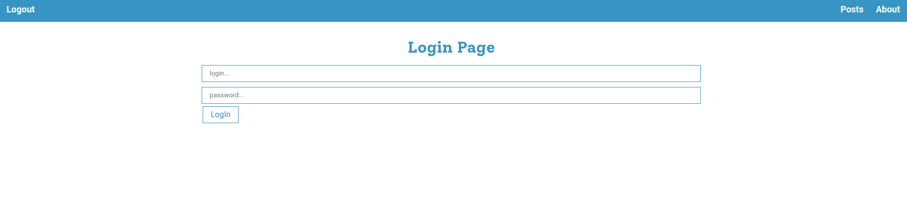
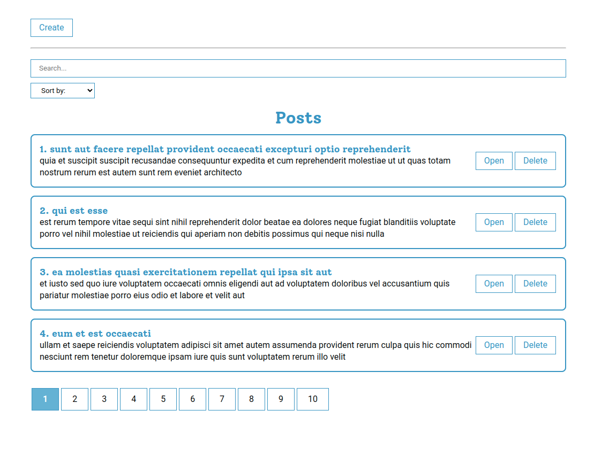

<br />



## Blog Posts
'Blog Posts' app using public API show some random posts. You can sort them, search some post, open some and see more information and post's comments, also you can add new ones or delete them.  

## Install
You can install this app on your PC and run it using npm

```sh
npm init
```

```sh
npm start
```
